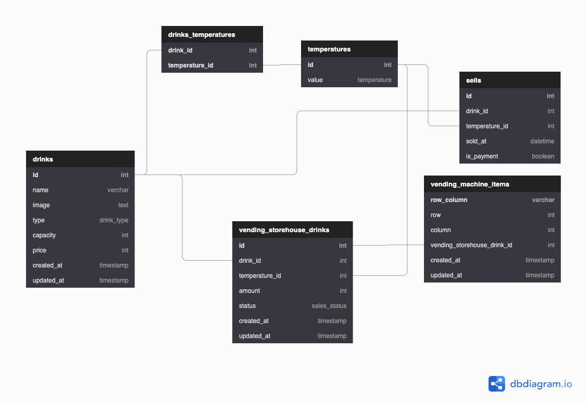

# maeding machine

WEDの冬休みの宿題。自動販売機。

# 環境/技術

- Kotlin
	- ktor
- MySQL 5.7
	- migration: [golang-migration/migrate](https://github.com/golang-migrate/migrate)
- GraphQL
- docker, docker-compose

# 仕様

- ドリンク
	- 名前
	- 画像
	- 缶 / ペット
	- サイズ(ml数)
	- 値段
	- 提供可能 温度  (冷 / 温 / 常温)
- ベンディングマシン
	- 3x5
		- ドリンク
		- 購入可能(残り本数)
		- 冷 / 温 / 常温
		- 購入可能かどうかのみ表示
		- 同じドリンク && 温度 があった場合は、同じ扱いする
	- たまに当たる
		- くじ付き
		- おまけ1本
	- お金
		- ユーザ毎にセッション持つ(10分)
		- 投入金額自由
		- 買ったらお釣り出る
	- 売れ行きのログ取りたい

# ER図



# Build

## migration

runでcmd渡したいなぁ。

```
$ docker-compose up db
$ docker-compose run migrate
```

## server


TODO


## 参考

- https://github.com/camuthig/ktor-social-graphql/